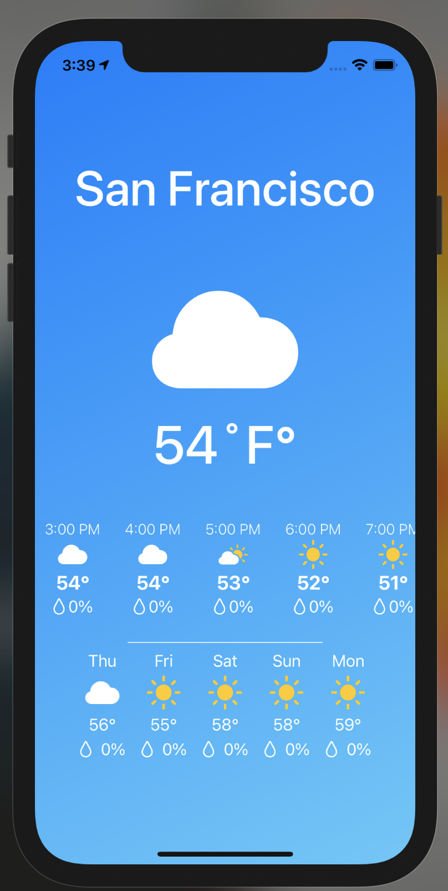
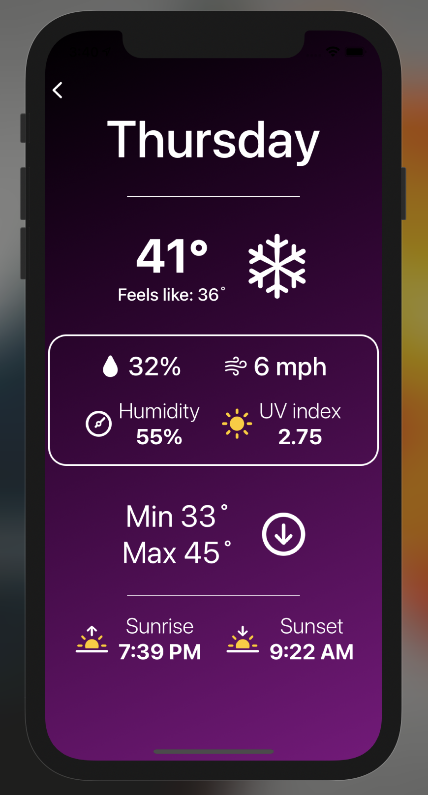

# iOS-OpenWeather

<div style="width: 1000px; height 600px;"></div>

## Introduction
The purpose of this project was to introduce myself to Swift and SwiftUI. This was my first ever project in iOS development. Many ideas and concepts were derived from tutorials listed under the acknowledgements section below. 

## Overview

iOS-OpenWeather is a weather app that uses the OpenWeatherMap API data using SwiftUI and Swift! 
Get weather information through a daily hourly format, or a 5-day forecast! iOS-OpenWeather incorporates:

- SwiftUI
- API implementation
- JSON parsing using Decodable
- Model View ViewModel (MVVM)
- NavigationView + NavigationLink transitions


## Custom Features

Additional features were added to the original functionality of the app, including:

- Custom UI design
- Theme change based on time
- 5-day forecast with additional details
- Hourly forecast

<div style="width: 1000px; height 600px;"></div>

## Getting Started

> This app is not currently available on the App Store, but may be in the near future.

### Prerequisites

- A Mac running macOS Catalina (beta)
- Xcode 11 (beta) or newer
- A valid API key from Open Weather Map


### Installation

1. Clone or download the project to your local machine
2. Double click `Weather.xcodeproj` in project root, or open the project's root in Xcode by pressing CMND + O and selecting project's root folder. 
3. Replace contents of string `API_KEY` with your valid Open Weather Map API key in `URLExtension.swift`. 
```
let API_KEY = "your_key_between_quotation_marks"
```
4. Run the simulator with any selected iOS simulated device.
5. If you wish to run the application on your personal device, please reference 

## Acknowledgements

Throughout the development of the project, the following were used for reference:

- [What is JSON - JSON Parsing in Swift] -> https://www.youtube.com/watch?v=_TrPJQWD8qs
- Icons [SF Symbols 2] -> https://developer.apple.com/sf-symbols/
- [Build Weather App in Swift and Xcode 12] -> https://www.youtube.com/watch?v=Xc6q_JltHSI

